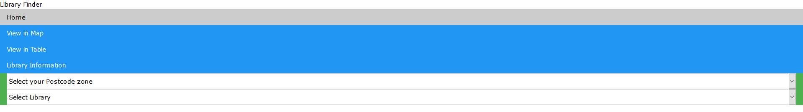
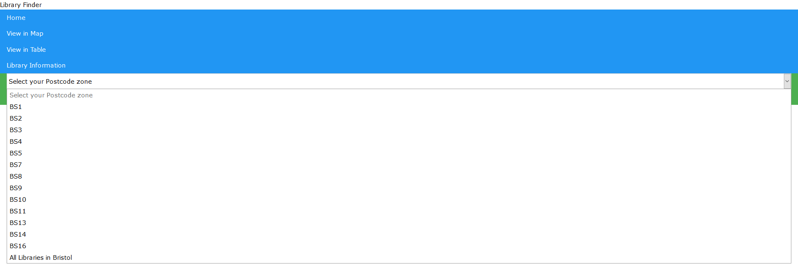
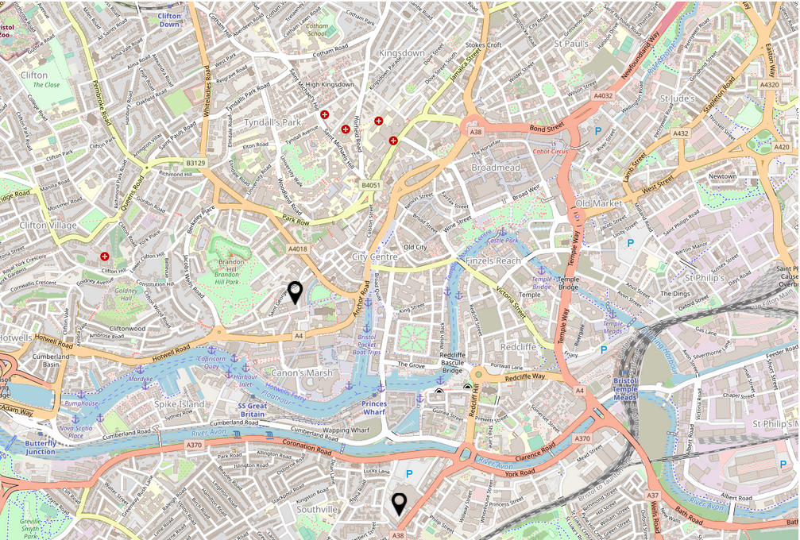
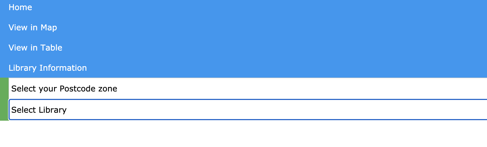
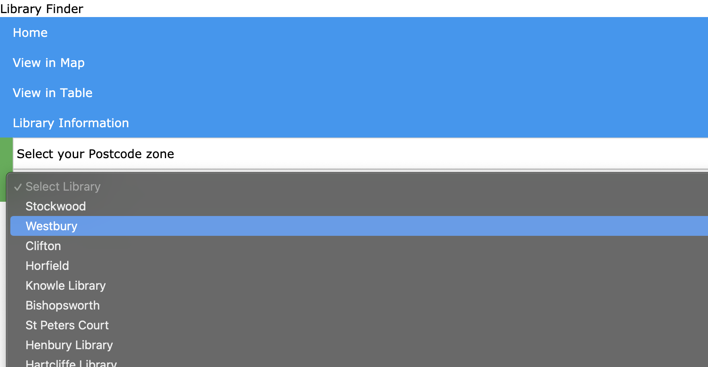
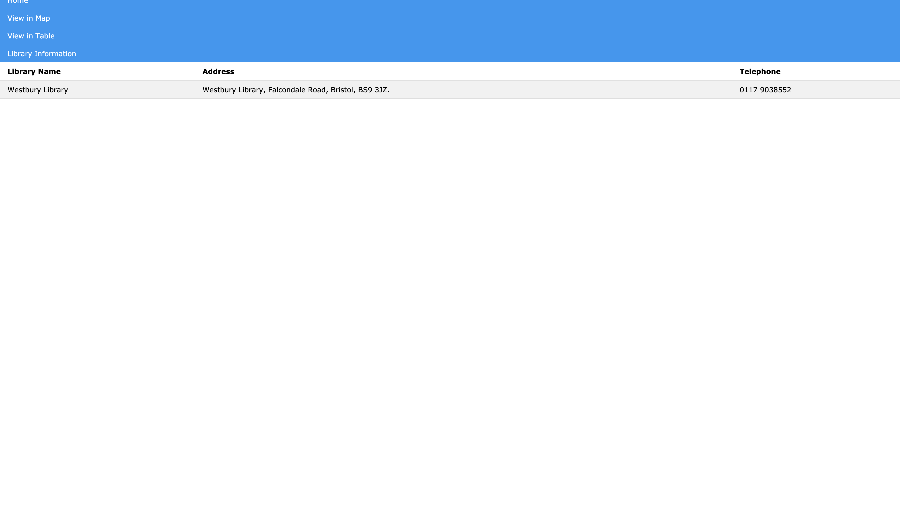

# Deployment

## Release Notes

This will be the first release version of the application, v1.0.0

Access from browser with http://localhost:8080/

# User guide
UC1:
1. Firstly the user will click on "select your postcode zone".

2. Secondly the user will select their desired zone from the dropdown. 

3. Finally the user will see their results displayed in the table.

UC2:
1. Firstly the user will click on "Select your postcode zone"

2. Secondly, the user will select their desired postcode zone from the dropdown.

3. Finally, the user will see an embed of OpenStreetMaps with the libraries marked on it.

UC3:
1. Firstly the user will click on 'Select Library'.

2. Secondly the user will select their library of choice from the menu.

3. The user will then be displayed the information for the library of choice.

