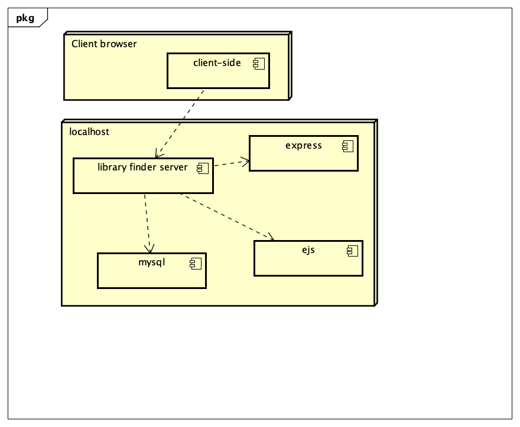

# Deployment

## Release Notes

This will be the first release version of the application, v1.0.0

Access from browser with http://localhost:8080/

# User guide
TODO: Explain how each use-case works by providing step-by-step screenshots for each use-case. This should be based on a tested scenario.

UC1:
images/uc1-1.png
images/uc1-2.png
images/uc1-3.png
![Insert screenshots here]
TODO: Repeat as necessary
