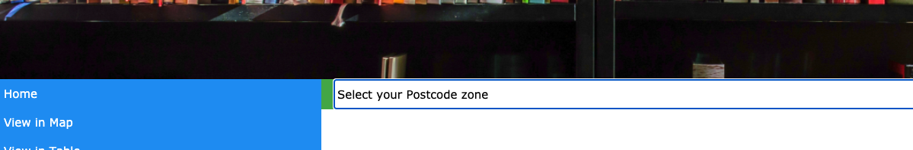
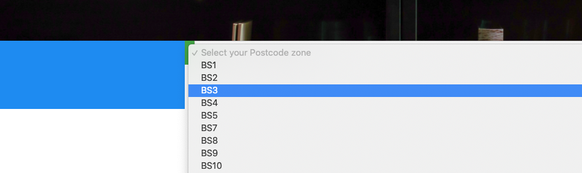
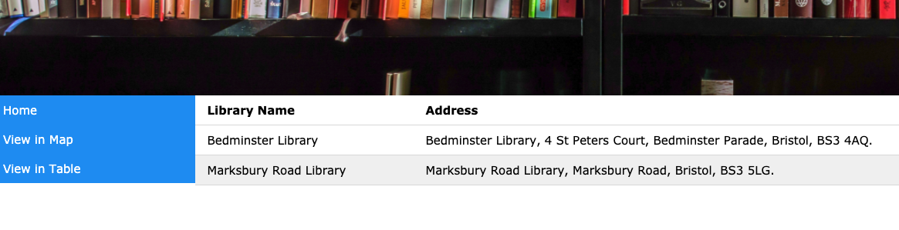

# Deployment

## Release Notes

This will be the first release version of the application, v1.0.0

Access from browser with http://localhost:8080/

# User guide
UC1:
1. Firstly the user will click on "select your postcode zone".

2. Secondly the user will select their desired zone from the dropdown. 

3. Finally the user will see their results displayed in the table.

UC2:
TODO: Explain how each use-case works by providing step-by-step screenshots for each use-case. This should be based on a tested scenario.

UC3:
1. Firstly the user will click on 'Select Library'.
![Insert screenshot here] 
2. Secondly the user will select their library of choice from the menu.
![Insert screenshot here]
3. The user will then be displayed the information for the library of choice.
4. ![Insert screenshot here]
