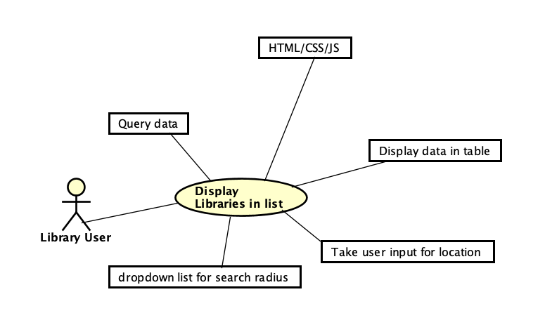
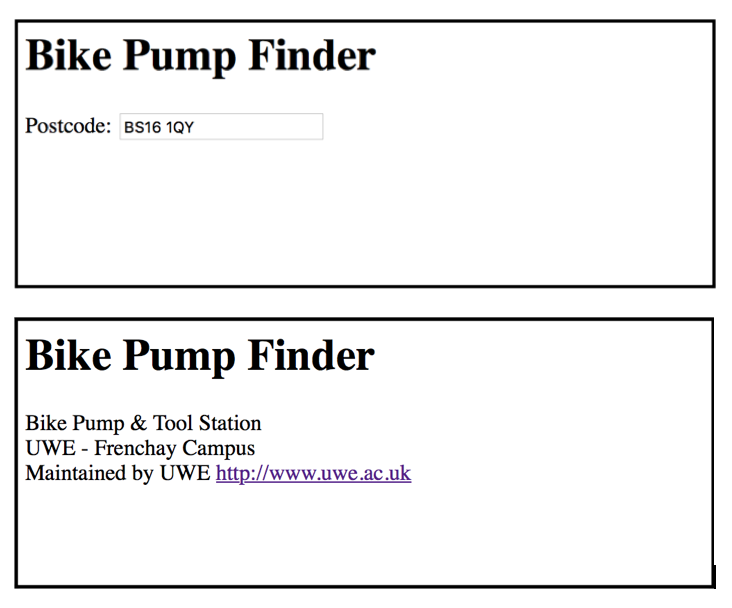

# Design

## Behavioural design
UC1: Library user access web page, they want to see their nearby libraries so they enter their location and click to get results. The system then accesses Bristol Open Data and gets the results within the search radius, then the web page will display these results in a table.

UC2:

UC3:

## User Interface design
TODO: Specify and develop a user interface mockup using an HTML wireframe.

TODO: repeat as necessary