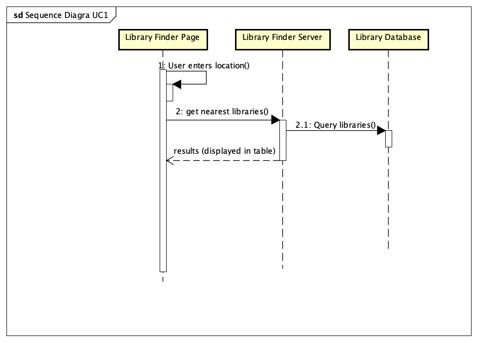
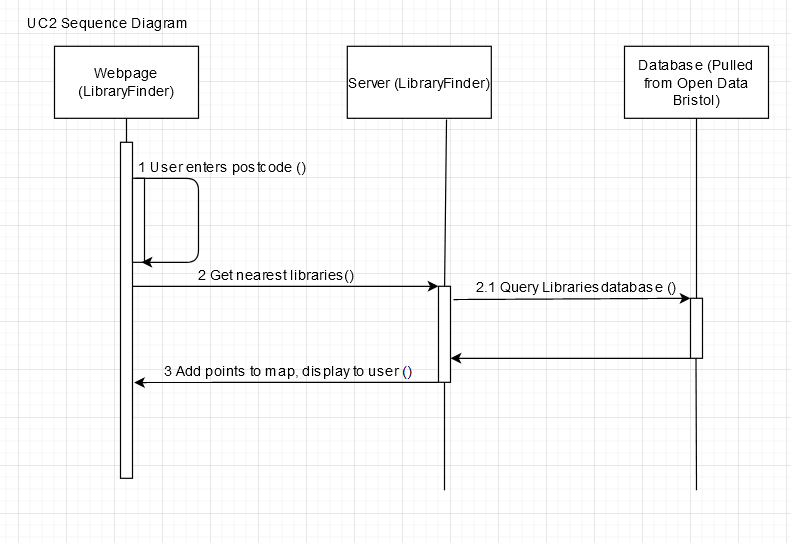
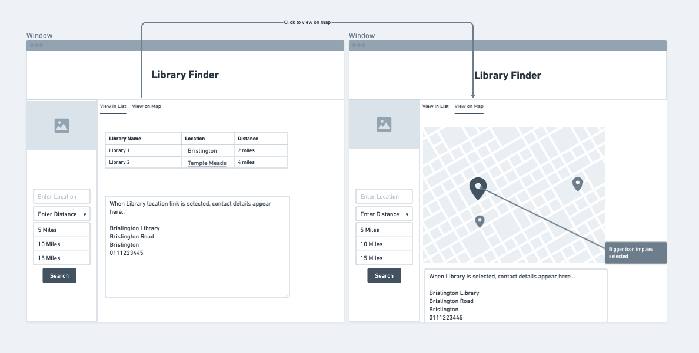

# Design

## Behavioural design
UC1: Library user access web page, they want to see their nearby libraries so they select their postcode zone and click to get results. The system then accesses the database (data taken from Bristol Open Data) and gets the results within the selected postcode zone, then the web page will display these results in a table.

UC2: Library user accesses the website, wanting to see their local libraries on a map to work out how to get there. They select "View on map". The system accesses the database (data again taken from Open Data Bristol) and gets results including the locations of every library in the area on a local map that is then displayed to them over an embedded map of the local area.

UC3: Library user accesses  wishes to contact a specific local library, potentially to check the availablility of a given book. They select their library of choice and click to get results. The system pulls data from the database (again, taken from Open Data Bristol) and gets the results presented to them in a table, with the contact information for the library displayed in a column of the table.

## User Interface design

