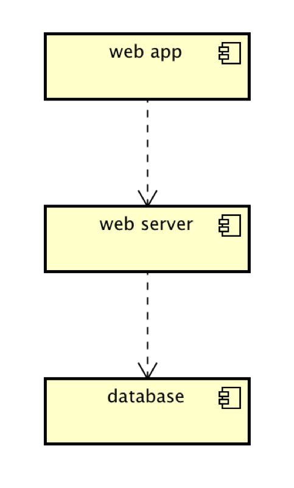

# Implementation

## Introduction
This will be the first release version of the application, v1.0.0

## Project Structure
All of the project files are located with the folder /server/. A brief description of these files and their purpose is provided below;

TODO: provide a table listing the number of jslint warnings/reports for each module.

| File | Description |
| ---- | ------- |
| **main.js** | The primary JavaScript file; acts as the server and handles all requests from the browser and appropriate responses. Also responsible for rendering the correct file EJS view and sending this as a response. |
| **/Views/index.ejs/** | View for the homepage |
| **/Views/map.ejs** | View for the map page; displays to the user the location of libraries on the map. |
| **/Views/table.ejs** | View for the table page; displays all libraries in the given area to the user. |
| **/Views/templates/head.ejs** | Template for the html head contains the liks to all stylesheets used etc. |
| **/Views/templates/header.ejs** | Template for the header of the page; Contains the title of the page and all relevant formatting. |
| **/Views/templates/nav.ejs** | Template for the navigation bar; contains buttons for navigation to each page of the site. |
| **/static/script.js** | Static JavaScript file containing 2 subroutines for getting the location of the user (geolocation) and loading the map with given co-ordinates. | 
| **/static/style.css** | Contains the style template for the site |

## Software Architecture
TODO: Describe the major components of your architecture. Are any particular architectural styles being used?

