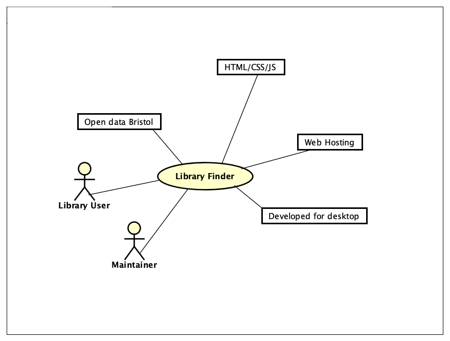

# Library Finder

## Business Case

### Problem statement
People are bored in Lockdown and have decided they want to start reading more books, therefore they want to know where their nearest library is. We will develop a simple app that helps users find their nearest Library.

### Business benefits
1. Users will be able to find their nearest library very easily.
2. Libraries can be a community hub, lots of different activities occur there, this could help connect people.

### Options Considered
Google maps will also show nearby libraries, however results can be cluttered with other surrounding points of interest.

### Expected Risks
Especially during covid-19 pandemic, opening hours and availability can vary and it is possible the libraries could be closed.

## Project Scope
1. have user friendly interface
2. take location input from user
3. access library data
4. show library data in order of relevance (nearest first)

