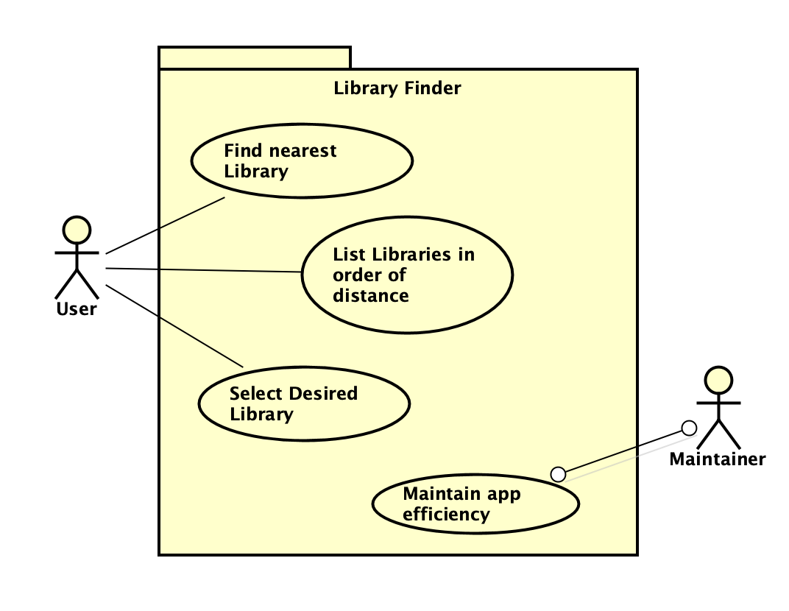

# Requirements

## User Needs

### Actors
Library User living in Bristol.

### User stories
As a Library User, I want to find my local Library, so that I can get a book to read.

### Use Cases

| UC1 | See a list of nearest Libraries | 
| --- | ------------------------------- |
| **Description** | Perform a location search to provide nearest libraries |
| **Actors** | Library User |
| **Assumptions** | Library User is wanting to find libraries that are stored on Bristol Open Data</td></tr>
| **Steps** | 1.
2.
3.
4.Library User enters their search location and radius |
| **Variations** | Library User incorrectly enters location, validation needed |
| **Non-functional** | System should limit the entry to postcode and address |
| **Issues** | Decide whether to use geolocation or manual entry |

| UC2 | See nearest Libraries on a map | 
| --- | ------------------------------ |
| **Description** | TODO: Goal to be achieved by use case and sources for requirement |
| **Actors** | TODO: List of actors involved in use case |
| **Assumptions** | TODO: Pre/post-conditions if any</td></tr>
| **Steps** | TODO: Interactions between actors and system necessary to achieve goal |
| **Variations** | TODO: OPTIONAL - Any variations in the steps of a use case |
| **Non-functional** | TODO: OPTIONAL - List of non-functional requirements that the use case must meet. |
| **Issues** | TODO: OPTIONAL - List of issues that remain to be resolved |

| UC3 | See opening times of nearest Libraries | 
| --- | -------------------------------------- |
| **Description** | TODO: Goal to be achieved by use case and sources for requirement |
| **Actors** | TODO: List of actors involved in use case |
| **Assumptions** | TODO: Pre/post-conditions if any</td></tr>
| **Steps** | TODO: Interactions between actors and system necessary to achieve goal |
| **Variations** | TODO: OPTIONAL - Any variations in the steps of a use case |
| **Non-functional** | TODO: OPTIONAL - List of non-functional requirements that the use case must meet. |
| **Issues** | TODO: OPTIONAL - List of issues that remain to be resolved |

## Software Requirements Specification
### Functional requirements

* FR1: The system shall request location input of user, and search radius (from UC1)
* FR2: The system shall get libraries within search area from database (from UC2)
* FR3: The system shall display Libraries in order of distance (from UC2)

### Non-Functional Requirements
* NFR1: The system shall display a welcome message and brief explanation of purpose (from UC1)
* NFR2: The system shall enable user to read information for desired library (from UC3)

