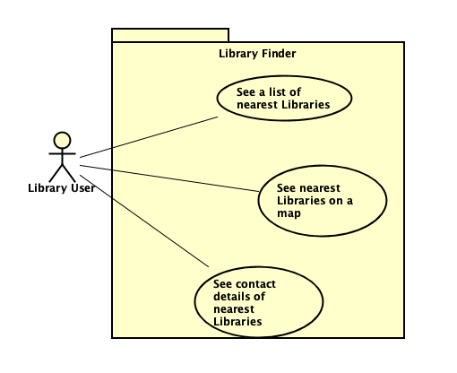

# Requirements

## User Needs

### Actors
Library User living in Bristol.

### User stories
Story 1: As a library user, I want to find my nearest libraries so that I can find the book I want.  
Story 2: As a library user, I want my nearest libraries marked on a map so that I can find the directions to get there from my present location.  
Story 3: As a library user, I want to see the opening times of my local libraries so that I can plan when to visit.  
### Use Cases

| UC1 | See a list of nearest Libraries | 
| --- | ------------------------------- |
| **Description** | Display the nearest Libraries to Library User in a list format |
| **Actors** | Library User |
| **Assumptions** | Library User wants to know if there are any Libraries nearby</td></tr>
| **Steps** | <ol><li>Library User enters their search location and radius</li><li>Program pulls all libraries from Bristol Open Data that are within the search radius</li><li>Program displays libraries in order of nearest first</li></ol>|
| **Variations** | <ul><li>Library user enters an invalid postcode - Validation required</li><li>Library user enters a postcode outside of the BS region - Warning message required (Open Data Bristol only stores data for the BS region)</li></ul> |
| **Issues** | There may be no results within set search radius |

| UC2 | See nearest Libraries on a map | 
| --- | ------------------------------ |
| **Description** | Display the nearest libraries to Library User on a map of the local area |
| **Actors** | Library User |
| **Assumptions** | The Library User wants to know the best possible routes to their local libraries </td></tr>
| **Steps** | <ol><li>Library user enters their postcode and radius</li><li>Program pulls data from Open Data Bristol and Google Maps</li><li>Program displays library locations from ODB on the map from Google Maps</li></ol> |
| **Variations** | <ul><li>Library user enters an invalid postcode - Validation required</li><li>Library user enters a postcode outside of the BS region - Warning message required (Open Data Bristol only stores data for the BS region)</li></ul> |
| **Issues** | Lack of experience relating to Google Maps' API could raise problems during development. |

| UC3 | See opening times of nearest Libraries | 
| --- | -------------------------------------- |
| **Description** | Display Contact Information for a Specified Library |
| **Actors** | Library User |
| **Assumptions** | The Library User has used the website to find the library they would like to get information about.</td></tr>
| **Steps** | <ol><li>User picks specified library from list previously displayed.</li><li>Programs pulls data from Open Data Bristol about the Library</li><li>Program displays contact information and address to the Library User</li></ol> |
| **Variations** | Link from map page for same function |
| **Issues** | Open Data Bristol may have no/partial data about chosen Library |

## Software Requirements Specification
### Functional requirements

* FR1: The system must request location input of user, and search radius (from UC1)
* FR2: The system must pull data from Open data Bristol (from all use cases)
* FR3: The system shall display libraries within search area from database (from UC1)
* FR4: The system shall display Library locations on a map (from UC2)
* FR5: The system shall display contact information for libraries (from UC3)

### Non-Functional Requirements
* NFR1: The system must produce accurate results (from UC1)
* NFR2: The system shall return results efficiently (from UC2)
* NFR3: The system shall have a user friendly interface